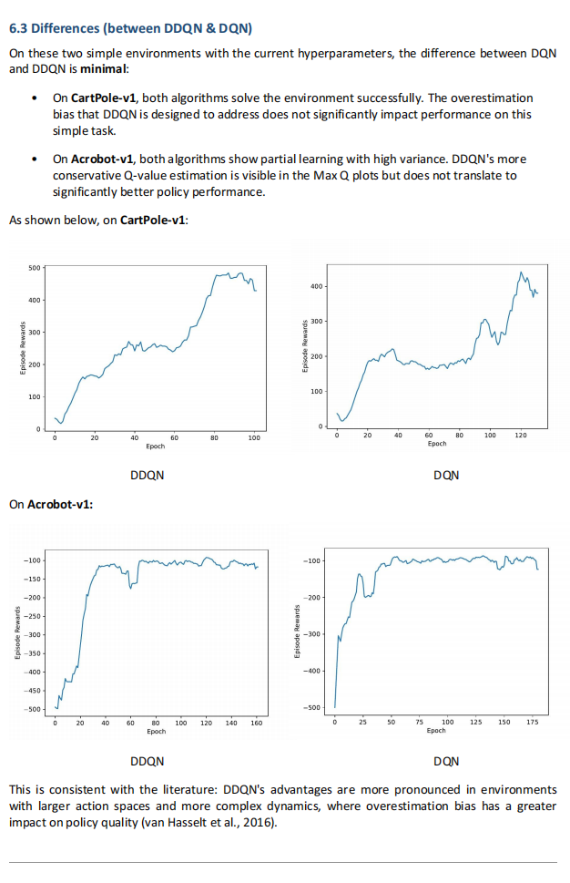
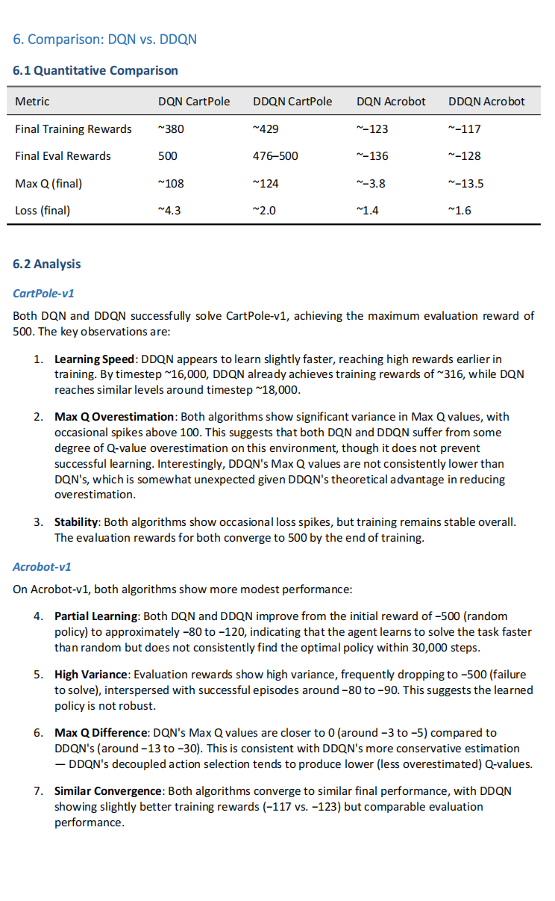
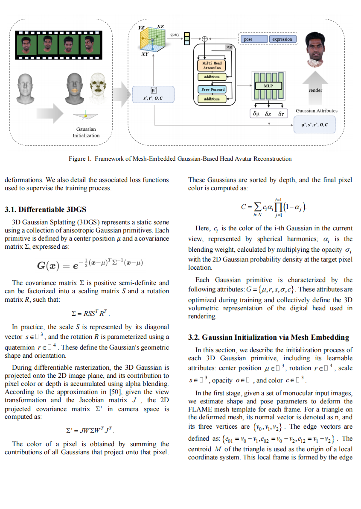
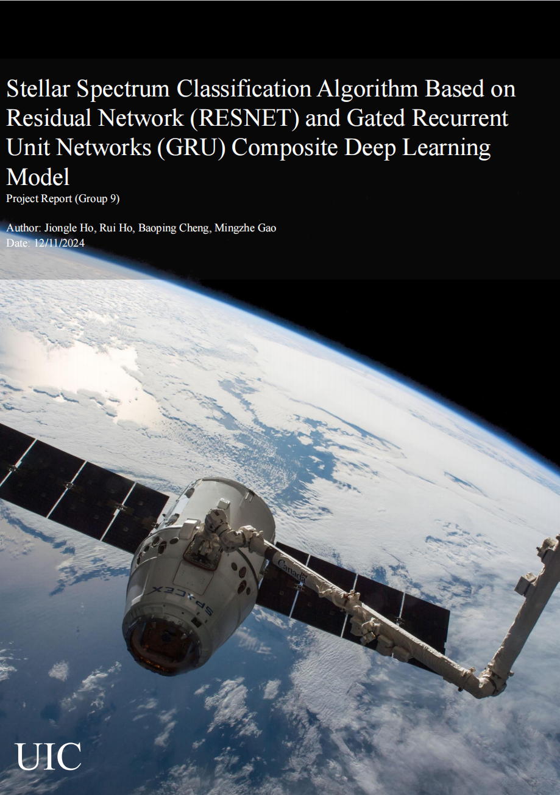

<h1 align="center">
  
</h1>

  <b>MSc AI @ HKUST · 3D Vision · Human-Object Interaction · World Models · Physical AI</b>

  Exploring how intelligent systems perceive, model, and interact with the physical world.

  <a href="mailto:JiongleHe@outlook.com">Email</a> ·
  <a href="https://github.com/JiongJiongJiong2">GitHub</a>

---

### About

My path has grown from **3D reconstruction and representation** toward understanding **interaction, dynamics, and intelligent systems in the physical world**. I enjoy both research and building usable systems, with current interests spanning **3D Vision, HOI, World Models, Embodied AI, Reinforcement Learning, and Physical AI**.

> *Ideas matter when you have the courage to build them.*

### Selected Work

- **[RMAvatar-MLP](https://github.com/JiongJiongJiong2/RMAVATAR-MLP)** — Final-year research project replacing grid-based canonical feature fields with an MLP + positional encoding representation.
- **[Does Ctrl+C Work?](https://github.com/JiongJiongJiong2/Does-CrtlC-Work)** — A lightweight desktop tool that gives immediate visual feedback for copy and paste actions.
- **[REINFORCE · A2C · PPO](https://github.com/JiongJiongJiong2/Reinforce-A2C-PPO_test)** — Implementations and experiments with classic policy-gradient reinforcement learning algorithms.
- **[DQN vs. Double DQN](https://github.com/JiongJiongJiong2/DQN-vs-DDQN--A-RL-learning-project-)** — A compact learning project comparing value-based deep reinforcement learning methods.

### Project Snapshots

<table>
  <tr>
    <td align="center" width="20%">
      
    </td>
    <td align="center" width="20%">
      
    </td>
    <td align="center" width="20%">
      
    </td>
    <td align="center" width="20%">
      
    </td>
    <td align="center" width="20%">
      
    </td>
  </tr>
  <tr>
    <td align="center"><b>Product / UI</b></td>
    <td align="center"><b>Reinforcement Learning</b></td>
    <td align="center"><b>DQN / DDQN</b></td>
    <td align="center"><b>Computer Vision</b></td>
    <td align="center"><b>Machine Learning</b></td>
  </tr>
</table>

### Tools

  

---

  

